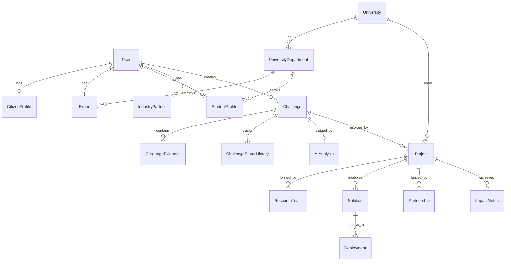

# SAMADHAAN Database & PostGIS Architecture

## Overview
SAMADHAAN uses **PostgreSQL 16** with the **PostGIS** spatial extension and **Prisma ORM**.

---

## 🏛️ Core Relational Entities

---

## 🗺️ Geospatial Indexing & Queries

1. **Composite Coordinates Index:** `@@index([latitude, longitude])`
2. **Radius Search:** Utilizes bounding-box pre-filtering followed by exact Haversine / ST_DWithin distance computation in kilometers.
3. **Hotspot Aggregation:** City and district level spatial clustering computed dynamically for heatmap visualization.
